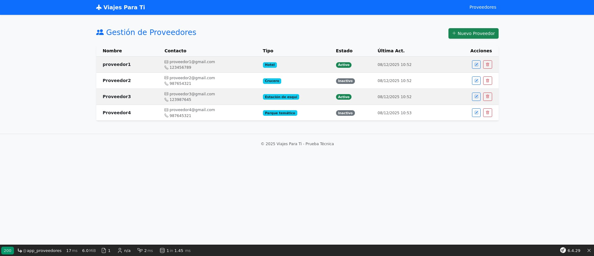
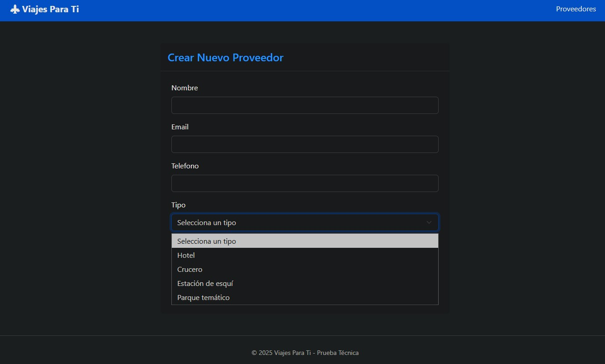

# Prueba Técnica - Viajes Para Ti ✈️

Proyecto desarrollado con **Symfony 6.4 LTS** para la gestión de proveedores.

El objetivo es ofrecer una herramienta rápida y sencilla para el departamento de contabilidad, permitiendo gestionar el ciclo de vida de los proveedores (CRUD) con una interfaz amigable y responsive.

## 🛠️ Tecnologías Utilizadas

* **Backend:** PHP 8.2, Symfony 6.4, Doctrine ORM.
* **Calidad & Testing:** PHPUnit (Tests Funcionales), Symfony Validator.
* **Base de Datos:** MySQL 8.
* **Frontend:** Twig, Bootstrap 5 (Responsive Design).
* **Infraestructura:** Docker & Docker Compose.

## 📸 Vistas de la Aplicación

| Listado con Buscador | Formulario de Creación/Edición |
| -------------------- | ---------------------- |
|  |  |

*(La aplicación es totalmente responsive y adaptable a móviles)*

### Opción A: Despliegue con Docker 🐳 (Recomendada)

1.  **Clonar y configurar el entorno:**
    ```bash
    git clone [https://github.com/errivi/viajes-para-ti.git](https://github.com/errivi/viajes-para-ti.git)
    cd viajes-para-ti
    cp .env.example .env
    ```

2.  **Levantar los servicios:**
    ```bash
    docker compose up -d --build
    ```
    > **Nota para Linux:** Si usa una versión antigua de Docker o Linux nativo, es posible que necesite permisos de superusuario y el guion: `sudo docker-compose up -d --build`.

3.  **Instalar dependencias y preparar Base de Datos:**
    *(Ejecutar una vez los contenedores estén en marcha)*
    ```bash
    # Instalar librerías PHP
    docker compose exec app composer install

    # Ejecutar migraciones
    docker compose exec app php bin/console doctrine:migrations:migrate

    # (Opcional) Cargar datos de prueba
    docker compose exec app php bin/console doctrine:fixtures:load
    ```
    *(Recuerde usar `sudo docker-compose ...` si está en Linux).*

4.  **Acceder a la aplicación:**
    👉 **http://localhost:8080/index.php/proveedores**

> **⚠️ Nota sobre Rendimiento en Windows:** Si ejecuta esto en Docker Desktop para Windows, es normal notar cierta latencia en la carga debido al sistema de archivos. En Linux/Producción la velocidad es instantánea.

---

### Opción B: Instalación Local (Manual) 💻

Si prefiere usar su propio servidor local (requiere PHP 8.2+ y MySQL):

1.  **Clonar e instalar:**
    ```bash
    git clone <URL_REPO>
    cd viajes-para-ti
    composer install
    ```
2.  **Configurar:** Copia `.env.example` a `.env` y ajusta `DATABASE_URL`.
3.  **Base de Datos:**
    ```bash
    php bin/console doctrine:database:create
    php bin/console doctrine:migrations:migrate
    # (Opcional) Cargar datos de prueba
    php bin/console doctrine:fixtures:load
    ```
4.  **Iniciar Servidor:**
    ```bash
    php -S 127.0.0.1:8000 -t public
    ```
    Accede a: **http://127.0.0.1:8000/proveedores**

---

## 🧪 Ejecución de Tests Automáticos

El proyecto incluye tests funcionales con **PHPUnit** para garantizar la estabilidad.

**En Docker:**
```bash
# Preparar BD de test (una sola vez)
docker compose exec app php bin/console --env=test doctrine:database:create
docker compose exec app php bin/console --env=test doctrine:schema:create

# Ejecutar tests
docker compose exec app php bin/phpunit
```
**En Local:**
```bash
# Preparar BD de test (una sola vez)
php bin/console --env=test doctrine:database:create
php bin/console --env=test doctrine:schema:create

# Ejecutar tests
php bin/phpunit